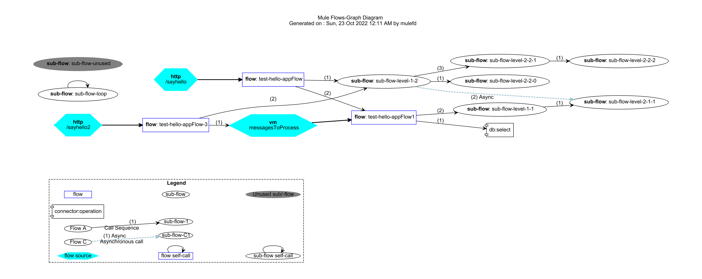

= Mule Flow Diagrams
:icons: font
:toc: macro

image:https://img.shields.io/github/release/manikmagar/mule-flow-diagrams.svg[Release,link=https://github.com/manikmagar/mule-flow-diagrams/releases]
image:https://github.com/manikmagar/mule-flow-diagrams/workflows/ci-build/badge.svg[Build Status,link=https://github.com/manikmagar/mule-flow-diagrams/actions]

toc::[]

== Introduction
Mule application can contain multiple flows and sub-flows. All these can reference each other for processing messages. Data can also be exchanged synchronously or asynchronously using connectors.

A project can easily have multiple configuration files with flows/sub-flows that are spread across those files. When analyzing mule application, it could be difficult to see the complete data processing flow and their dependencies.

Have you ever wished to visualize your flow dependencies? How does message flows through your application?

If so, then try this `muleflowdiagrams` application. It can read your configuration files and generate a diagrams that can easily tell you how your flows are connected.

[source, bash]
----
$ muleflowdiagrams
Missing required parameter: <sourcePath>
Usage: muleflowdiagrams [-hV] [-d=<diagramType>] [-o=<outputFilename>]
						[-t=<targetPath>] <sourcePath>
Create Flow diagrams from mule configuration files.
	<sourcePath>   Source directory path containing mule configuration files
-d, --diagram=<diagramType>
					Type of diagram to generate. Valid values: GRAPH, SEQUENCE
					Default: GRAPH
-h, --help         Show this help message and exit.
-o, --out=<outputFilename>
					Name of the output file
					Default: mule-diagram
-t, --target=<targetPath>
					Output directory path to generate diagram
-V, --version      Print version information and exit.

Copyright: 2020 Manik Magar, License: MIT
Website: https://github.com/manikmagar/mule-flow-diagrams
----

For an example mule configuration link:./itests/test-hello-app.xml[./itests/test-hello-app.xml], run following command to generate a flow diagram -

[source, bash]
----
$ muleflowdiagrams ./itests/test-hello-app.xml -t ./itests/output
----



== Features
* Visualize mule flow dependencies and data flow.
* Identify unused mule flows and sub-flows.
* Identify flow spaghetti situations.
* Visualize synchronous and asynchronous data processing points.
* Identify connector dependencies and usage.
* Detect a possible recursive flow executions.

== Requirements
At the minimum, Java 8 is required. The build pipeline also tests it against JDK 11+.

Tested and verified to use on OSX, Linux and Windows.

== Installation

=== Homebrew icon:apple[]

On OSX you can install 'java' and `muleflowdiagrams` with https://brew.sh[Homebrew] using custom taps.

To install Java 8:

[source, bash]
----
brew tap AdoptOpenJDK/openjdk
brew cask install adoptopenjdk8
----

Once Java is installed you can use brew with https://github.com/manikmagar/homebrew-tap/[manikmagar/tap] to get `muleflowdiagrams`:

`brew install manikmagar/tap/muleflowdiagrams`

To upgrade to the latest version:

`brew upgrade manikmagar/tap/muleflowdiagrams`

Test running `muleflowdiagrams --version` in CLI.

=== Scoop icon:windows[]
On Windows, you can install `muleflowdiagrams` using https://scoop.sh[Scoop] - A command-line installer for Windows.

Once you have Scoop installed and JDK configured, you can run following commands to get `muleflowdiagrams` -

```bash
scoop bucket add manikmagar https://github.com/manikmagar/scoop-bucket
scoop install muleflowdiagrams
```

To upgrade, you can run -

```bash
scoop update muleflowdiagrams
```

=== Manual install icon:apple[] icon:windows[] icon:linux[]
. Unzip the https://github.com/manikmagar/mule-flow-diagrams/releases/latest[latest binary release].
. Add `muleflowdiagrams-<version>/bin` folder in to your $PATH
. Test running `muleflowdiagrams --version` in CLI.

=== Build and Run
This project uses Gradle to compile and build. To create a zip distribution, run below command in project directory -
[source, bash]
----
./gradlew distZip
----

To install the distribution, run `./gradlew installDist`. This will explode the generated zip file to `./build/install` directory. You can verify binaries by executing `sh build/install/muleflowdiagrams/bin/muleflowdiagrams --version`.

== Usage

`muleflowdiagrams` support various arguments for generating diagrams.

Example:
`muleflowdiagrams ~/AnypointStudio/studio-workspace/mule-flow-diagrams-demo`

[source, bash]
----
$ muleflowdiagrams
Missing required parameter: <sourcePath>
Usage: muleflowdiagrams [-hV] [-d=<diagramType>] [-o=<outputFilename>]
						[-t=<targetPath>] <sourcePath>
Create Flow diagrams from mule configuration files.
	<sourcePath>   Source directory path containing mule configuration files
-d, --diagram=<diagramType>
					Type of diagram to generate. Valid values: GRAPH, SEQUENCE
					Default: GRAPH
-h, --help         Show this help message and exit.
-o, --out=<outputFilename>
					Name of the output file
					Default: mule-diagram
-t, --target=<targetPath>
					Output directory path to generate diagram
-V, --version      Print version information and exit.

Copyright: 2020 Manik Magar, License: MIT
Website: https://github.com/manikmagar/mule-flow-diagrams
----

==== Out of memory errors?

If your application is large and contains too many flows, process could fail with `Exception in thread "main" java.lang.OutOfMemoryError: Java heap space` error.

Try increasing the JVM allocated memory using `-Xmx` flag.

```bash
$ JAVA_OPTS='-Xmx1024m' muleflowdiagrams ~/AnypointStudio/studio-workspace/mule-flow-diagrams-demo
```

For windows, you may need to set it at environment level -

```bash
set JAVA_OPTS=%JAVA_OPTS% -Xmx1024m
muleflowdiagrams.bat ~/AnypointStudio/studio-workspace/mule-flow-diagrams-demo
```


=== Source directory
Source directory is a required argument. This argument specifies where mule xml configuration files be searched.

This argument value can be one of the following:

* Path of the individual mule xml file. Eg. `~/Downloads/test-app-config.xml`. In this case, diagram for just this file is generated.
* Path to a standard mule 4 or mule 3 project root. Eg. `~/AnypointStudio/studio-workspace/mule-flow-diagrams-demo`.
** Mule 3: All configurations from `src/main/app/` are scanned to generate a diagram.
** Mule 4: All configurations from `src/main/mule/` are scanned to generate a diagram.
* Path to any non-mule project directory.

=== Diagram Types
Current release supports generating `Graph` diagram only.

=== Output arguments
Target directory to output generated diagram can be specified with `-t {directoryPath}` option. This is an optional argument and defaults to the source directory (or parent directory if source is a file).

The file name for diagram defaults to `mule-diagram.png`. This can be changed by specifying `-o {filename}` argument.

== Copyright & License

Licensed under the MIT License, see the link:LICENSE[LICENSE] file for details.
