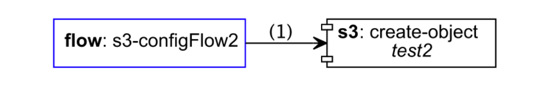

= Mule Flow Diagrams [mulefd]
ifndef::env-github[:icons: font]
ifdef::env-github[]
:caution-caption: :fire:
:important-caption: :exclamation:
:note-caption: :paperclip:
:tip-caption: :bulb:
:warning-caption: :warning:
endif::[]
:toc: macro

image:https://img.shields.io/github/release/manikmagar/mulefd.svg[Release,link=https://github.com/manikmagar/mulefd/releases]
image:https://github.com/manikmagar/mulefd/workflows/ci-build/badge.svg[Build Status,link=https://github.com/manikmagar/mulefd/actions]
image:https://api.dependabot.com/badges/status?host=github&repo=manikmagar/mulefd[Dependabot Status,https://dependabot.com]
image:https://sonarcloud.io/api/project_badges/measure?project=manikmagar_mulefd&metric=vulnerabilities[SonarCloud Vulnerability]
image:https://sonarcloud.io/api/project_badges/measure?project=manikmagar_mulefd&metric=alert_status[SonarCloud Quality]

toc::[]

== Introduction
Mule application can contain multiple flows and sub-flows. All these can reference each other for processing messages. Data can also be exchanged synchronously or asynchronously using connectors.

A project can easily have multiple configuration files with flows/sub-flows that are spread across those files. When analyzing mule application, it could be difficult to see the complete data processing flow and their dependencies.

Have you ever wished to visualize your flow dependencies? How does message flows through your application?

If so, then try this `mulefd` application. It can read your configuration files and generate a diagrams that can easily tell you how your flows are connected.

.mulefd CLI commands
[source, bash]
----
$ mulefd
mulefd is a tool to generate beautiful diagrams for your mule application flows.
Usage: mulefd [-hV] [COMMAND]

Some command examples:
- mulefd graph <MULE_APP_PATH>
	Generate a Graph diagram for mule configuration in mule app
- mulefd help graph
	See help for Graph generation

-h, --help      display this help message
-V, --version   display version info
Commands:
help     Displays help information about the specified command
version  Display version info
graph    Create beautiful graph diagrams for mule flows
config   Manage MuleFD Global configuration

Copyright: 2020-2022 Manik Magar, License: MIT
Website: https://github.com/manikmagar/mulefd
----

For an example mule configuration link:./itests/test-hello-app.xml[./itests/test-hello-app.xml], run following command to generate a flow diagram -

[source, bash]
----
$ mulefd graph -t ./itests/output ./itests/test-hello-app.xml
----

== Features
* Visualize mule flow dependencies and data flow.
* Visualize mule flow dependencies for a single flow.
* Identify unused mule flows and sub-flows.
* Identify flow spaghetti situations.
* Visualize synchronous and asynchronous data processing points.
* Identify connector dependencies and usage.
* Detect a possible recursive flow executions.

== Requirements
At the minimum, Java 8 is required. The build pipeline also tests it against JDK 11+.

Tested and verified to use on OSX, Linux and Windows.

=== Graphviz Engine
This tool uses Graphviz Engine to generate Graph diagrams. It will use the first available engine, in following order -

* Native DOT engine if https://graphviz.org/download/[installed]. This is preferred and much more performant engine compared to other engines (see https://github.com/manikmagar/mulefd/issues/286[issue#286]).
* EclipseSource J2V8 Engine, bundled with this utility.
** J2V8 engine is _NOT available_ for Apple Silicon (M1). Consider install DOT engine or use JDK 8 or 11 for Nashorn.
* JDK JavaScript Nashorn engine. Slowest compared to the other two.
** Nashorn engine has been deprecated in JDK 11 and remove in JDK 15.

== Installation

=== SDKMan icon:linux[] icon:apple[]

Recommended way to install both java and Mule flow diagrams is https://sdkman.io[sdkman] for Linux and OSX.

To https://sdkman.io/install[install] SDKMAN and Java -
[source, bash]
----
curl -s "https://get.sdkman.io" | bash
source "$HOME/.sdkman/bin/sdkman-init.sh"

sdk install java
----

Once Java is installed and ready, you install Mule Flow Diagrams -

[source, bash]
----
sdk install mulefd
----

To test your installation run:

[source, bash]
----
mulefd help
----

This should print out usage information.

For upgrading existing installations via SDKMAN,run:

[source]
----
sdk upgrade mulefd
----

=== Homebrew icon:apple[]

On OSX you can install 'java' and `mulefd` with https://brew.sh[Homebrew] using custom taps.

To install Java 8:

[source, bash]
----
brew tap AdoptOpenJDK/openjdk
brew cask install adoptopenjdk8
----

Once Java is installed you can use brew with https://github.com/manikmagar/homebrew-tap/[manikmagar/tap] to get `mulefd`:

`brew install manikmagar/tap/mulefd`

To upgrade to the latest version:

`brew upgrade manikmagar/tap/mulefd`

Test running `mulefd help` in CLI.

=== Docker icon:docker[]
If you don't want to install `mulefd`, you can run it via docker.

[source,bash]
----
docker run -v `pwd`:/app manikmagar/mulefd /app
----

This will generate diagrams in `pwd` or mounted directory.

Docker container resources are limited. Based on the size of your application, you may see outofmemory errors when executing with docker. You can allocate more memory with `-m` option to docker run command, Eg. `-m 512m`.

=== Scoop icon:windows[]
On Windows, you can install `mulefd` using https://scoop.sh[Scoop] - A command-line installer for Windows.

Once you have Scoop installed and JDK configured, you can run following commands to get `mulefd` -

[source,bash]
----
scoop bucket add manikmagar https://github.com/manikmagar/scoop-bucket
scoop install mulefd
----

To upgrade, you can run -

[source,bash]
----
scoop update mulefd
----

=== Manual install icon:apple[] icon:windows[] icon:linux[]
. Unzip the https://github.com/manikmagar/mulefd/releases/latest[latest binary release].
. Add `mulefd-<version>/bin` folder in to your $PATH
. Test running `mulefd help` in CLI.

=== Running with JBang
You can run MuleFD using https://jbang.dev[JBang]. If you have jbang installed, you can run `jbang mulefd@manikmagar/mulefd` to run latest release of MuleFD.

=== Build and Run
This project uses Gradle to compile and build. To create a zip distribution, run below command in project directory -
[source, bash]
----
./gradlew distZip
----

To install the distribution -

. Clone the project
. Run `./gradlew installDist`. This will explode the generated zip file to `./build/install` directory.
. You can verify binaries by executing -
.. icon:apple[] icon:linux[] : `sh build/install/mulefd/bin/mulefd help`
.. icon:windows[] : `./build/install/mulefd/bin/mulefd.bat help`

== Configuration
`mulefd` supports external properties configuration to change the behavior of the tool. You can create a file `${user.home}/.mulefd/mulefd.properties` and provide configuration properties.

To see the current properties, including the defaults of the tool, run following command -

.List config properties
[source, bash]
----
$ mulefd config list
----

=== Supported Properties

Following properties are supported in the config properties:

- `diagram.font.name`: To change the font used for graph text, set this to the name of the font available on target system. Eg. Arial or Courier.

NOTE: If generated diagram has node label's going out of the shape, try changing the font to the one available on the systm.

== Usage

`mulefd` support various arguments for generating diagrams.

*Example:*
`mulefd graph ~/AnypointStudio/studio-workspace/mulefd-demo`

.Generating Graph diagram
[source, bash]
----
$ mulefd graph
Missing required parameter: '<sourcePath>'
Create beautiful graph diagrams for mule flows.
Usage: mulefd graph [-hV] [-gs] [-fl=<flowName>] [-o=<outputFilename>]
					[-t=<targetPath>] <sourcePath>
	<sourcePath>        Source directory path containing mule configuration
							files
	-fl, --flowname=<flowName>
						Target flow name to generate diagram for. All
							flows/subflows not related to this flow will be
							excluded from the diagram.
	-gs, --genSingles   Generate individual diagrams for each flow.
-h, --help              display this help message
-o, --out=<outputFilename>
						Name of the output file
-t, --target=<targetPath>
						Output directory path to generate diagram
-V, --version           display version info
----

*_Out of memory errors?_*

If your application is large and contains too many flows, process could fail with `Exception in thread "main" java.lang.OutOfMemoryError: Java heap space` error.

Try increasing the JVM allocated memory using `-Xmx` flag.

[source,bash]
----
$ JAVA_OPTS='-Xmx1024m' mulefd graph ~/AnypointStudio/studio-workspace/mulefd-demo
----

For windows, you may need to set it at environment level -

[source,bash]
----
set JAVA_OPTS=%JAVA_OPTS% -Xmx1024m
mulefd.bat graph ~/AnypointStudio/studio-workspace/mulefd-demo
----

=== Source directory
Source directory is a required argument. This argument specifies where mule xml configuration files be searched.

This argument value can be one of the following:

* Path of the individual mule xml file. Eg. `~/Downloads/test-app-config.xml`. In this case, diagram for just this file is generated.
* Path to a standard mule 4 or mule 3 project root. Eg. `~/AnypointStudio/studio-workspace/mulefd-demo`.
** Mule 3: All configurations from `src/main/app/` are scanned to generate a diagram.
** Mule 4: All configurations from `src/main/mule/` are scanned to generate a diagram.
* Path to any non-mule project directory.

=== Generate Individual flow diagrams
When running against a large mule application, the generated `mule-diagram.png` can contain too many flows. To simplify understanding each flow, it can be helpful to generate diagrams per flow (not sub-flows).

You can specify `-gs` or `--genSingles` option to generate individual flow diagrams, in addition to the consolidated one.

These diagrams are generated at `{targetPath}/single-flow-diagrams/{currentDateTime}` directory. Each generated diagram has the same name as flow it represents.

NOTE: Some flow names, especially the APIKit generated flows can contain characters not valid for some OS. Names are thus sanitized. Any character not in `a-zA-Z0-9.-` is replaced with `_`.

=== Flowname
If you just want to generate diagram for a single flow then specify it with `-fl` or `--flowname` option. This will exclude all flows and subflows that are not related to this target flow.

=== Diagram Types
Current release supports generating `Graph` diagram only.

=== Output arguments
Target directory to output generated diagram can be specified with `-t {directoryPath}` option. This is an optional argument and defaults to the source directory (or parent directory if source is a file).

The file name for diagram defaults to `mule-diagram.png`. This can be changed by specifying `-o {filename}` argument.

== Known modules/connectors
Mule has many connectors/modules that can be used for building flows and sub-flows, and list keeps growing. This tool maintains a list of known components with their supported operations for including in the generated diagram.

You can find this list in source code link:src/main/resources/default-mule-components.csv[].

Each record in this file has following columns -

[source, csv]
----
prefix,operation,sourceFlag,path,configName,async

----
* **prefix**: Namespace of module/connector. Eg. `vm`, `http` etc.
* **operation**: Name of an operation or input source in that namespace. Eg. `listener`, `consume` in `vm` etc. This supports wildcard entries (values defined as `*`) for non-source (`sourceFlag=false`) entries.
* **sourceFlag**: `true` if `operation` is an input source withing that namespace. Eg. `listener` in `vm`.
* **path**: Name of the attribute on operation which can help identify resource path. Eg. `queueName` for `vm:listener` or `path` for `http:request`. For sources, this is visible on source nodes in diagram.
* **configName**: Name of the module configuration. Eg. `config-ref` attribute name for `vm:listener`. For sources, this is visible on source nodes in diagram. This can help identify source uniquely when multiple configuration exists.
* **async**: `true` if this is an asynchronous operation. Defaults to `false`.

The generated diagram will represent these known components using the Component share.

=== Registering custom modules
If any module is missing in the default list - either being a new module or a custom module, then it is possible for users to register their modules.

If `mulefd-components.csv` named CSV file exists in `sourcePath`, then all modules/connectors within that file are registered as known components. Structure of this file must be same as default components file explained above.

See example file at link:src/test/resources/mulefd-components.csv[].

== Troubleshooting

=== Getting None of the provided engines could be initialized
This tool uses Graphviz-Java library to generate diagrams. Graphviz-Java https://github.com/nidi3/graphviz-java#how-it-works[describes] how the engines are leveraged. To execute the graphviz layout engine, one of these options is used:

. If the machine has graphviz installed and a `dot` command is available, spawn a new process running dot.
. Use this https://github.com/mdaines/viz.js[javascript version] of graphviz and execute it on the V8 javascript engine. This is done with the bundled https://github.com/eclipsesource/J2V8[J2V8] library.
. Alternatively, the javascript can be executed on Java's own Nashorn or GraalVM engine (preferring Graal if both are available).

This tool bundles the J2V8 library but it https://github.com/manikmagar/mulefd/issues/244[does not support] Apple M1. The Java's Nashorn engine was deprecated starting JDK 9 and removed in JDK 15.

So, if your diagram generation is failing with that error then check one of the following -

1. Which JDK is used? Using JDK's prior to 15 will at-least make the Nashorn engine available. It may be slower to run when compared to others.
2. If JDK 15+ is being used on Apple M1, make sure the `dot` is installed. It is a part of Graphviz, so check https://graphviz.org/download/#mac[here] for installing graphviz with `brew install graphviz`.

== Copyright & License

Licensed under the MIT License, see the link:LICENSE[LICENSE] file for details.
